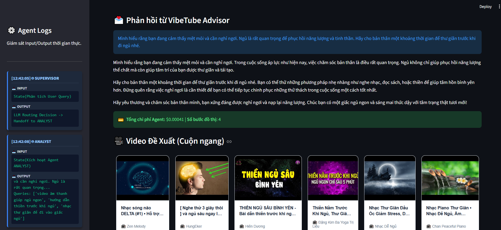
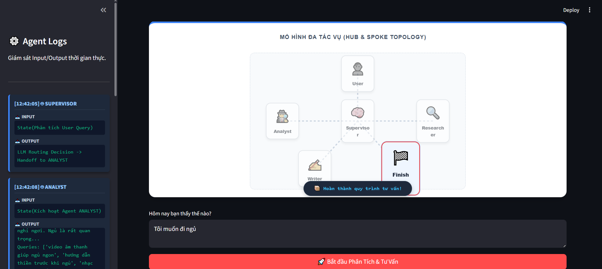
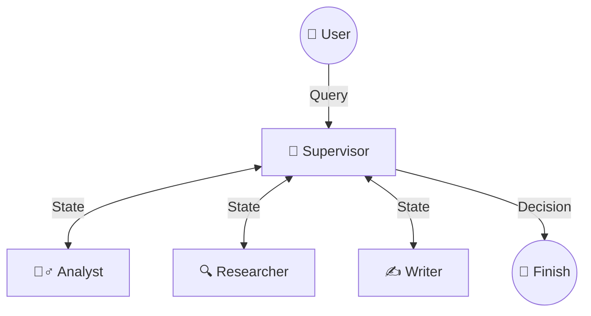

# 📺 VibeTube Advisor Pro (Lab 20 Completed)

<div align="center">
  
  
</div>
<p align="center">
  <em>(Ghi chú: Bạn hãy chụp 2 tấm ảnh: 1 ảnh chụp cái Đồ thị động ở trên cùng, và 1 ảnh chụp phần Kết quả + Video lướt ngang ở dưới, lưu vào thư mục <code>docs/</code> với tên <code>demo_graph.png</code> và <code>demo_results.png</code> để hiển thị cạnh nhau nhé!)</em>
</p>

**VibeTube Advisor Pro** là một hệ thống **Multi-Agent Research System** hoàn chỉnh được xây dựng dựa trên kiến trúc LangGraph và OpenAI. Khác với các Chatbot thông thường, VibeTube hoạt động như một "Bác sĩ tâm lý số", có khả năng thấu cảm cảm xúc của người dùng, tự động tìm kiếm các video YouTube phù hợp để giải toả tâm trạng và gửi gắm những lời khuyên sâu sắc.

Đặc biệt, hệ thống hoạt động như một "Tắc kè hoa" ngôn ngữ: **Bạn tâm sự bằng ngôn ngữ nào, hệ thống sẽ phân tích, tìm video và phản hồi bằng chính ngôn ngữ đó!**

---

## 🌟 Tính năng nổi bật

- **Multi-Agent Workflow (Hub & Spoke)**: Luồng hoạt động rõ ràng với `Supervisor` làm trung tâm điều phối 3 Agent chuyên biệt: `Analyst`, `Researcher`, và `Writer`.
- **Giao diện Dynamic Streamlit**: Đồ thị luồng động (Dynamic Flow Graph) mô hình không gian hiển thị trực quan dữ liệu truyền qua lại giữa các Agent theo thời gian thực.
- **Agent Logs chuyên nghiệp**: Theo dõi chi tiết `Input` / `Output` của từng Agent ngay trên giao diện Sidebar (Dark mode).
- **Horizontal Video Scroll**: Tích hợp danh sách video YouTube dạng cuộn ngang (Carousel) mượt mà, bảo mật tuyệt đối không bị lỗi render HTML.
- **Cost Tracking**: Tính toán và hiển thị chi phí (Cost) của LLM minh bạch sau mỗi lần chạy luồng.

---

## 🧠 Kiến trúc Multi-Agent (Hub & Spoke Topology)

Hệ thống được thiết kế theo mô hình **Supervisor-Worker**, tách biệt trách nhiệm (Separation of Concerns) để đảm bảo độ chính xác và dễ dàng debug.



### Các Role (Vai trò):
1. **Supervisor**: Đóng vai trò là Não bộ điều phối. Nhận `ResearchState`, đánh giá xem hệ thống đã thu thập đủ dữ liệu chưa và quyết định bước đi tiếp theo.
2. **Analyst**: Chuyên gia tâm lý. Phân tích cảm xúc người dùng, đưa ra lời khuyên ban đầu và tạo các "Từ khoá tìm kiếm YouTube" tối ưu sát với ngôn ngữ của người dùng.
3. **Researcher**: Chuyên gia tìm kiếm. Nhận từ khoá từ Analyst, gọi **YouTube Data API v3** để lấy siêu dữ liệu (Metadata) của các video phù hợp nhất.
4. **Writer**: Chuyên gia nội dung. Tổng hợp lời khuyên từ Analyst để viết một lá thư chân thành, ấm áp gửi đến người dùng (tuyệt đối không hiển thị link thô để nhường phần UI cho Streamlit lo liệu).

---

## 🚀 Hướng dẫn cài đặt & Sử dụng

### 1. Yêu cầu hệ thống
- Python 3.10+
- OpenAI API Key
- YouTube Data API v3 Key

### 2. Cài đặt môi trường

```bash
# Tạo môi trường ảo
python -m venv .venv

# Kích hoạt môi trường (Windows)
.venv\Scripts\activate
# (Hoặc MacOS/Linux): source .venv/bin/activate

# Cài đặt thư viện
pip install -e "[dev]"
```

### 3. Cấu hình API Keys

Tạo file `.env` từ file template:
```bash
cp .env.example .env
```
Mở file `.env` và điền các thông tin:
```env
OPENAI_API_KEY="sk-..."
OPENAI_MODEL="gpt-4o-mini"
YOUTUBE_API_KEY="AIzaSy..."
```

### 4. Chạy Ứng dụng Streamlit (Cách trải nghiệm tốt nhất)

Đây là giao diện tương tác chính của dự án:

```bash
streamlit run streamlit_app.py
```
Giao diện sẽ tự động mở trên trình duyệt tại `http://localhost:8501`.

### 5. Chạy lệnh CLI Benchmark (Dành cho đánh giá hệ thống)

Bạn có thể chạy thử lệnh đánh giá để so sánh tốc độ và chi phí giữa cấu hình Baseline (Single-Agent) và hệ thống Multi-Agent của chúng ta:

```bash
python -m multi_agent_research_lab.cli benchmark --query "Tôi đang cảm thấy rất mệt mỏi và kiệt sức vì công việc."
```
Kết quả Benchmark sẽ được lưu tự động vào thư mục `reports/benchmark_report.md`.

---

## 📁 Cấu trúc Dự án

```text
.
├── src/multi_agent_research_lab/
│   ├── agents/              # Chứa logic các Agent (Supervisor, Analyst, Researcher, Writer)
│   ├── core/                # Định nghĩa ResearchState, Schemas chia sẻ chung
│   ├── graph/               # Workflow LangGraph biên dịch đồ thị
│   ├── services/            # Tích hợp OpenAI Client & YouTube Search Client
│   ├── evaluation/          # Công cụ đo lường Benchmark
│   └── cli.py               # Công cụ tương tác dòng lệnh
├── docs/                    # Tài liệu Thiết kế, Rubric và Peer Review
├── reports/                 # Nơi lưu trữ các file Report xuất ra
├── streamlit_app.py         # Mã nguồn của ứng dụng Giao diện Chính (Main UI)
├── PLAN.md                  # Roadmap theo dõi tiến độ dự án
└── README.md                # Tài liệu hướng dẫn bạn đang đọc
```

---

## ✅ Deliverables đã hoàn thành (Đạt chuẩn 8 Milestones)
- [x] Tích hợp LLM Client an toàn và tái sử dụng tốt.
- [x] Tích hợp YouTube Data API v3 thực tế.
- [x] Thiết kế State và Graph Workflow vững chắc (tránh infinite loop).
- [x] Hệ thống Benchmark rõ ràng, xuất file Markdown.
- [x] Thiết kế UI Production-ready bằng Streamlit (Có Đồ thị luồng động & Video Carousel).
- [x] Xử lý rào cản ngôn ngữ (Language Alignment: Prompt = Ngôn ngữ nào -> Trả lời = Ngôn ngữ đó).
- [x] Đánh giá Peer Review & Exit Ticket đầy đủ.

*Dự án hoàn thiện cho bài Lab 20 - Multi-Agent Research System.*
